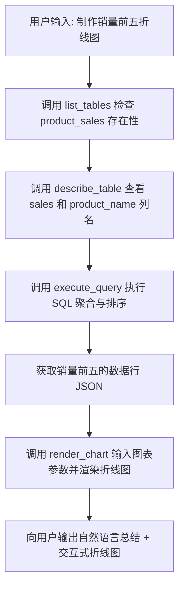

# Agent 核心工具与能力

LakeMind Agent 的智能交互并不是黑盒魔法，而是基于 Rust `rig` 智能体框架所包装的 **14 个高精度数据分析工具**。当您用自然语言下达命令时，Agent 会根据上下文，自动选择并组合调用这些工具。

---

## 数据探查与分析工具

### 1. `list_tables` (查看表列表)
- **作用**：让 Agent 能够了解当前工作区中存在哪些已经注册的 Parquet 临时表、CSV 本地表或 DuckDB 物理表。
- **Agent 何时调用**：对话的第一步，用于确认用户询问的数据集是否存在。

### 2. `describe_table` (获取表结构)
- **作用**：提取特定表的所有列名、数据类型以及可空属性。
- **Agent 何时调用**：在编写 SQL 语句之前，用以精确匹配字段名与关联条件，防止字段名不存在导致 SQL 报错。

### 3. `sample_data` (采样数据)
- **作用**：对指定表检索前几行数据（默认 5-10 行）。
- **Agent 何时调用**：理解脏数据、复杂枚举值分布或时间格式时调用。这比只看列名更能帮助 Agent 理解字段的具体商业含义。

### 4. `execute_query` (执行 SQL 查询)
- **作用**：在工作区的本地 DuckDB 实例中执行只读（SELECT）SQL 代码，并返回格式化后的 JSON 结果流。
- **安全保障**：被限制为只读执行，且在后台进行了超时上限约束，百万行级大数据分析可在 1 秒内完成。

---

## 交互与可视化工具

### 5. `render_chart` (渲染可视化图表)
- **作用**：这是 LakeMind 的明星工具。接收 Agent 提炼的图表配置参数（包括图表类型如柱状/折线/饼图、X轴/Y轴映射、数值数组等），并在前端控制台为用户直接生成交互式图表。
- **用户体验**：无需用户手动绘制，分析完数据后，图表会直接展示在 Chat 气泡正下方。

---

## 数据湖仓管理工具

### 6. `materialize_remote_table` (物化远程表格)
- **作用**：支持从远程 HTTP/HTTPS URL、S3 桶等云端路径，直接将 Parquet 或 CSV 等文件下载并高效物化（Materialize）写入到本地工作区的 `lake.duckdb` 中。
- **特点**：支持断点续传与元数据校对，非常适合加载公开数据集。

### 7. `create_table` & `create_view` & `drop_object` (DDL 操作)
- **作用**：允许 Agent 帮您在本地数据湖中整理数据。例如，根据某个复杂的分析逻辑建立临时的聚合视图（View）或物理表（Table），以供后续的查询和对话复用。

### 8. `check_source_fingerprint` (指纹比对)
- **作用**：用于校验外部大文件的数据完整性。如果外部 Parquet/CSV 被其他软件修改过，Agent 会自动识别出指纹差异，提示用户是否需要重新同步。

---

## OKF 商业知识库管理

### 9. `search_okf_recipes` / `write_okf_block` / `tidy_okf_knowledge`
- **作用**：操作 LakeMind 的商业知识库。
- **功能说明**：允许 Agent 在 OKF 知识库中搜寻用户预先写入的口径，或者在对话过程中将学到的新知识（如“活跃用户的计算公式”）写入本地知识块，实现自我知识的分类整理。

---

## Agent 的思考过程示例

当您问：**“帮我把 product_sales 表里销量前五的产品名做成折线图”**，Agent 的后台决策链条如下：

