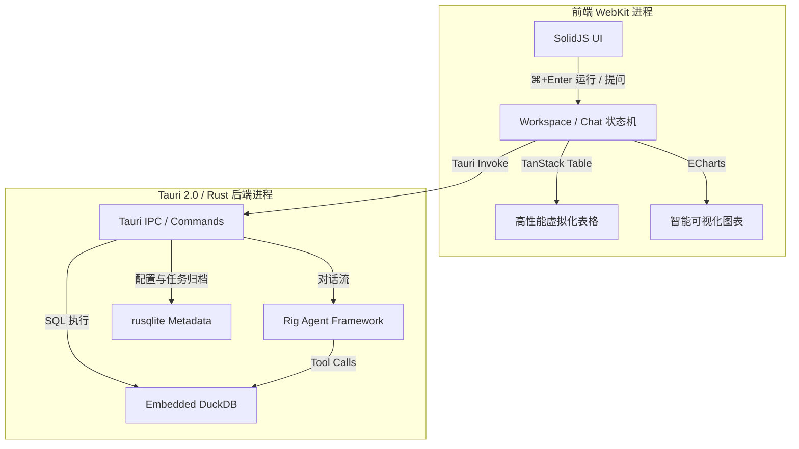

# LakeMind 技术架构

LakeMind 是一款利用现代桌面端技术栈与嵌入式 OLAP 引擎构建的轻量级、高性能数据分析工作台。本章将详细剖析其底层设计与技术实现。

---

## 整体架构图

LakeMind 整体由两大部分组成：前端的用户交互界面（基于 SolidJS）与后端的计算与智能控制核心（基于 Rust + Tauri）。

---

## 核心技术选型

| 层次 | 技术选型 | 理由与优势 |
| :--- | :--- | :--- |
| **应用外壳 (Shell)** | **Tauri 2.0 (Rust)** | 相较于 Electron 具有极低的内存占用和安装包体积，且支持 Rust 原生加速。 |
| **计算引擎 (Compute)** | **Embedded DuckDB (Rust Bundled)** | 单机嵌入式分析引擎王者。对 Parquet、CSV 和 Excel 的分析性能可匹敌大型云端数仓，且支持极低开销的就地注册。 |
| **元数据存储 (Metadata)** | **SQLite (via rusqlite)** | 独立于 DuckDB 存储。用于全局管理所有 Workspaces、Chat 历史会话和 SQL 任务索引，防止 DuckDB 文件损坏导致元数据丢失。 |
| **Agent 框架 (AI Framework)** | **Rig SDK (Rust)** | 高性能、类型安全的 Rust 智能体开发框架，能够流式地（Streaming）输出 Agent 决策与推理过程。 |
| **前端与通讯 (Frontend & IPC)** | **SolidJS & Tauri Binary IPC** | 采用零拷贝二进制序列化管道进行 Rust 与 WebKit 进程间的通信（免除 JSON 编解码开销），结合前端细粒度响应渲染与虚拟滚动（`@tanstack/solid-virtual`），实现 100k+ 行级数据集的 60fps 顺滑滚动。 |

---

## 关键技术设计

### 1. 双库协同设计 (DuckDB + SQLite)
- **`lake.duckdb` (每个工作区独立)**：专注于大数据量的列式分析。大文件就地关联，只加载需要的字段到内存。
- **`~/.lakemind/lakemind.db` (SQLite 全局元数据)**：存储系统设置、工作区路径列表、以及所有历史 Tasks (SQL/Chat 文本)。即使重装应用，只要数据库和工作区在，状态就能百分之百恢复。

### 2. 大文件 `In-Place` 注册与小文件归档策略
为了在大文件分析与项目可移植性之间取得平衡，LakeMind 的 Ingest 模块采取了双轨制：
- **小文件 (默认 < 200 MB)**：导入时会自动复制到工作区下的隐藏目录中。如此一来，整个工作区文件夹可以被打包压缩发送给同事，在他们电脑上开箱即用。
- **大文件 (默认 > 200 MB)**：仅将文件路径以 **符号视图 / In-Place** 的形式注册进 DuckDB 引擎。DuckDB 会直接通过操作系统指针读取外部物理文件，避免了数吉字节大文件复制产生的磁盘消耗和等待时间。

### 3. 乱序脏数据多策略嗅探 (Messy Loader)
为了应对业务日常导出的非标准文件：
- **CSV 嗅探**：先提取文件头 1KB 进行编码分析（防止中文 GBK 乱码），随后进行分隔符探测（Probing `\t` / `;` / `|`），再对数据行进行格式推导。
- **Excel 多偏移量表头评分**：针对开头前 5 行可能存在的标题干扰，采用表头质量评分算法自动定位真实的表格首行。

### 4. 零拷贝数据传递管道 (Zero-Copy)
前端虚拟列表需要高速消费后端数据。Tauri 2.0 底层将 DuckDB 查询返回的 Rust 结果，通过二进制序列化直接传递给 WebKit 进程，在保证响应速度的同时，彻底告别了海量 JSON 字符串解析造成的界面假死。
